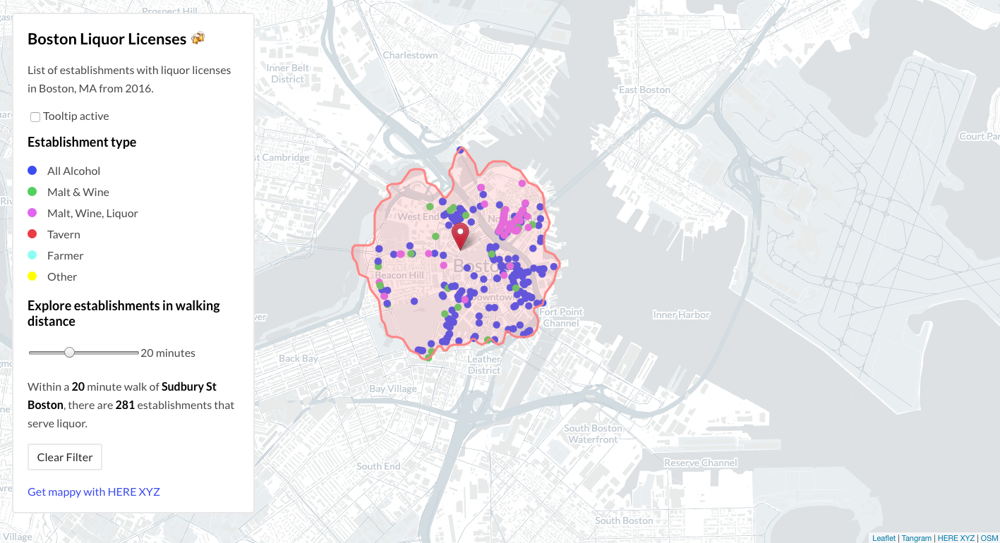

# Boston Liquor Licenses


This is an interactive map of Boston liquor licenses from 2016. Data is available from the [Boston Data Portal](https://data.boston.gov/dataset/liquor-licenses).

This map was made with [React](https://react-leaflet.js.org), [XYZ Hub API](https://www.here.xyz/api/), [Leaflet](https://leafletjs.com/), and [Tangram](https://github.com/tangrams/tangram).

## Live Demo

You can view a live demo of the map at: [dbabbs.github.io/boston-liquor](https://dbabbs.github.io/boston-liquor)

## Running locally

```
git clone https://github.com/dbabbs/boston-liquor.git
cd boston-liquor
npm install
npm start
```
